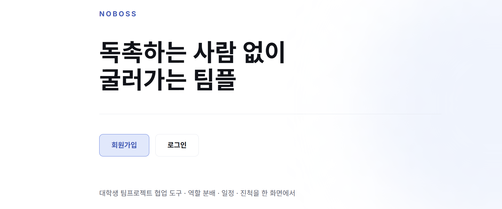
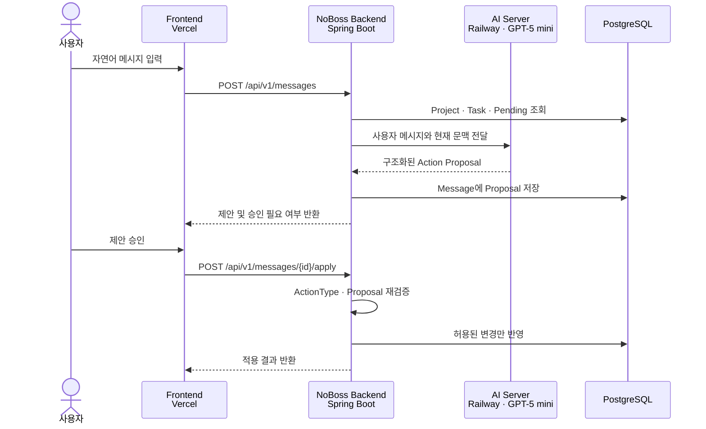
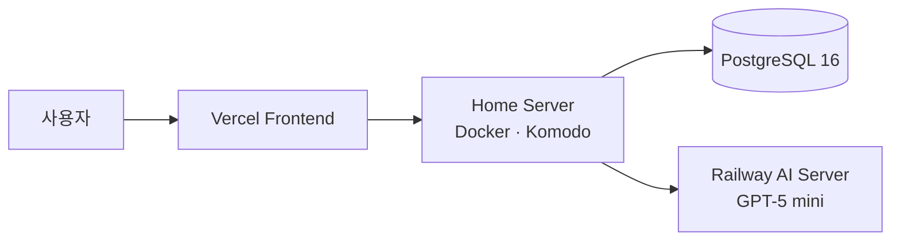

<div align="center">

# NoBoss Backend

### 독촉하는 사람 없이 굴러가는 팀플

자연어로 프로젝트와 업무를 관리하고, AI의 변경 제안을 승인한 뒤 안전하게 반영하는 팀 프로젝트 협업 서비스

<a href="https://no-boss.vercel.app/">
  
</a>

</div>

---

## 프로젝트 소개

팀 프로젝트에서는 일정과 담당 업무가 자주 바뀌지만, 매번 관리 화면을 찾아 직접 수정하는 과정은 번거롭다. NoBoss는 팀 채팅에 자연어로 요청하면 AI가 현재 프로젝트 문맥을 바탕으로 변경안을 작성해주는 서비스다.

- 프로젝트 기본 정보와 단계별 업무를 한 화면에서 확인
- 마감이 임박했거나 지난 미완료 업무를 실시간으로 탐지
- 자연어에서 업무 생성·수정 또는 프로젝트 변경 내용 추출
- AI 제안은 사용자가 승인한 경우에만 실제 데이터에 반영

> AI는 구조화된 Action을 제안한다. 사용자의 직접적인 승인 이후 백엔드의 제한된 Action Executor가 검증된 변경만 실행한다.

---

## 핵심 동작

```text
사용자: "다음 주 금요일까지 사용자 인터뷰 5명 해야 해"
   ↓
AI: TASK_CREATE 제안
    · 단계: 2단계 리서치
    · 담당자: 윤세아
    · 마감일: 2026-09-04
   ↓
사용자: "담당자는 정하람이야"
   ↓
AI: 직전 미승인 제안을 반영한 수정안 생성
   ↓
사용자 승인 → 백엔드 검증 → Task DB 반영
```

승인 대기 제안은 최신 1개만 유지한다. 새로운 제안이 생성되면 직전 제안은 `SUPERSEDED` 상태가 되고, 최신 `PENDING` 제안만 승인할 수 있다.

---

## AI 연동 구조



### 서버가 필요한 이유

| 역할 | 설명 |
|---|---|
| 문맥 구성 | DB에서 현재 Project, 전체 Task, 직전 Pending Proposal을 조회해 AI 서버에 전달한다. |
| 응답 검증 | AI 응답을 `NONE`, `TASK_CREATE`, `TASK_UPDATE`, `PROJECT_UPDATE`로 제한하고 필수 필드와 날짜를 검증한다. |
| 제안 보관 | 구조화된 Proposal을 PostgreSQL `JSONB`로 저장하고 승인 상태를 관리한다. |
| 안전한 실행 | 승인 시 저장된 Proposal을 다시 검증하고 허용된 Entity 변경 메서드만 실행한다. |
| 중복 방지 | Message를 잠금 조회해 동일 제안이 동시에 두 번 반영되는 것을 방지한다. |

> AI 서버는 자연어 이해와 구조화된 제안 생성 담당. 
최종 변경은 사용자 승인에 따라 백엔드 서버에서 처리.

---

## Proposal 스펙

| ActionType | 의미 | 승인 필요 | 실제 반영 시점 |
|---|---|---:|---|
| `NONE` | 일반 대화 또는 변경 없는 응답 | X | 반영하지 않음 |
| `TASK_CREATE` | 새로운 업무 생성 제안 | O | 승인 API 호출 후 |
| `TASK_UPDATE` | 기존 업무 수정 제안 | O | 승인 API 호출 후 |
| `PROJECT_UPDATE` | 프로젝트 기본 정보 수정 제안 | O | 승인 API 호출 후 |

AI 응답 예시

```json
{
  "aiMessage": "사용자 인터뷰 마감일을 9월 4일로 변경할까요?",
  "actionType": "TASK_UPDATE",
  "requiresApproval": true,
  "proposal": {
    "taskId": 2,
    "stage": 2,
    "stageName": "리서치",
    "title": "사용자 인터뷰 5명 진행",
    "owner": "윤세아",
    "dueDate": "2026-09-04"
  }
}
```

---

## 주요 API

| Method | Endpoint | 설명 |
|---|---|---|
| `GET` | `/api/v1/project` | 현재 프로젝트 기본 정보 조회 |
| `GET` | `/api/v1/tasks` | 단계별 전체 업무 조회 |
| `PATCH` | `/api/v1/tasks/{taskId}/done` | 업무 완료 상태 변경 |
| `GET` | `/api/v1/tasks/risks` | 지연 위험 업무 실시간 조회 |
| `POST` | `/api/v1/messages` | 자연어 메시지 기반 변경 제안 생성 및 저장 |
| `POST` | `/api/v1/messages/{messageId}/apply` | 승인된 변경 제안 적용 |

---

## 기술 스택

| 분류 | 기술 | 선택 이유 |
|---|---|---|
| Language | Java 21 | 안정적인 타입 시스템과 최신 LTS 환경을 사용한다. |
| Framework | Spring Boot 4.1.1, Spring Web MVC | REST API와 계층별 비즈니스 로직을 단순하게 구성한다. |
| Persistence | Spring Data JPA, Hibernate | 승인된 Action을 도메인 변경 메서드로 일관되게 반영한다. |
| Database | PostgreSQL 16 | 관계형 프로젝트 데이터와 `JSONB` Proposal을 함께 저장한다. |
| Migration | Flyway | 개발·배포 환경의 스키마와 초기 데이터를 동일하게 관리한다. |
| AI Client | Spring `RestClient` | 별도 Railway AI 서버와 동기 HTTP 통신한다. |
| API Docs | Springdoc OpenAPI | 프론트엔드와 API 요청·응답 규격을 공유한다. |
| Build | Gradle | Java 빌드와 테스트 의존성을 관리한다. |
| Deploy | Docker, Komodo, Home Server | 백엔드와 PostgreSQL을 컨테이너로 운영한다. |

---

## 배포 구성




## 실행

```bash
./gradlew bootRun
```

## 팀원

|  |  | 
| :---: |:----------------------------------------------------:|:----------------------------------------------------:|
| [**김민경**](https://github.com/kmg22) |         [**김도영**](https://github.com/dddyoung2)          | [**박선우**](https://github.com/sunwoo07)     